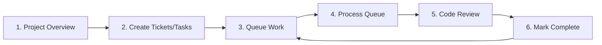
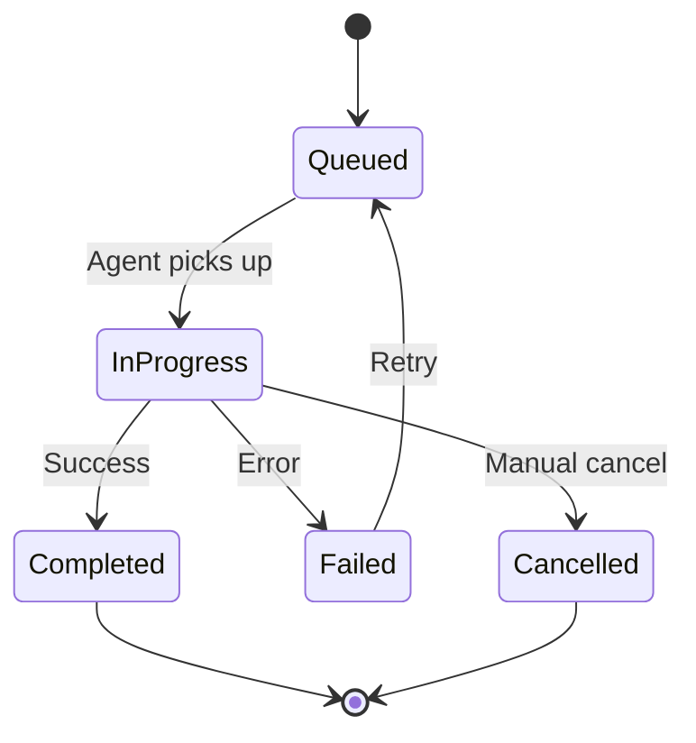

# Promptliano MCP Usage Guide

> A comprehensive guide to effectively using the Promptliano Model Context Protocol (MCP) tools for AI-assisted development with emphasis on queue-based task processing and automated code review.

## Table of Contents

1. [Quick Start](#quick-start)
2. [Core Workflow](#core-workflow)
3. [MCP Tools Reference](#mcp-tools-reference)
4. [Queue System Deep Dive](#queue-system-deep-dive)
5. [Best Practices](#best-practices)
6. [Common Workflows](#common-workflows)
7. [Tips and Tricks](#tips-and-tricks)

---

## Quick Start

### The Golden Path: Overview → Plan → Queue → Process → Review

The most effective way to use Promptliano MCP is to follow this workflow:



### Step 1: Always Start with Overview

```
mcp__promptliano__project_manager(
  action: "overview",
  projectId: 1754713756748
)
```

This gives you:

- Active project context and selected files
- Recent tickets and their status
- Queue status (items pending processing)
- Files needing summarization
- Project structure and statistics

### Step 2: Create Tickets and Tasks

Use the `promptliano-planning-architect` agent for comprehensive planning:

```
# Use the Task tool with promptliano-planning-architect
Task(
  subagent_type: "promptliano-planning-architect",
  description: "Plan authentication feature",
  prompt: "Create tickets and tasks for implementing user authentication with login, logout, and session management"
)
```

Each ticket/task created will include:

- **Suggested files**: Relevant files to work with
- **Suggested prompts**: Context-specific prompts
- **Agent assignments**: Specialized agents for each task

### Step 3: Queue the Work

```
mcp__promptliano__queue_manager(
  action: "create_queue",
  projectId: 1754713756748,
  data: {
    name: "Feature Development",
    description: "Queue for new feature implementation",
    maxParallelItems: 1
  }
)

# Enqueue entire ticket with all tasks
mcp__promptliano__queue_manager(
  action: "enqueue_ticket",
  projectId: 1754713756748,
  data: {
    queueId: 123,
    ticketId: 456,
    priority: 5
  }
)
```

### Step 4: Process the Queue

```
# Get next task from queue
mcp__promptliano__queue_processor(
  action: "get_next_task",
  data: {
    queueId: 123,
    agentId: "my-agent-id"
  }
)

# Process the task...
# Implementation here...

# Mark as completed
mcp__promptliano__queue_processor(
  action: "complete_task",
  data: {
    itemId: 789,
    completionNotes: "Implemented authentication component"
  }
)
```

### Step 5: Automatic Code Review

After implementing each feature, **always** use specialized code review agents:

```
Task(
  subagent_type: "staff-engineer-code-reviewer",
  description: "Review authentication implementation",
  prompt: "Review the authentication feature implementation for security, performance, and best practices"
)
```

### Step 6: Mark Complete and Continue

When a ticket is complete:

- All tasks are marked as done
- Ticket is automatically dequeued
- Queue statistics are updated
- Move to next item in queue

---

## Core Workflow

### 1. Project Context Gathering

#### Overview First, Always

The project overview is your starting point for **every** session:

```
mcp__promptliano__project_manager(
  action: "overview",
  projectId: 1754713756748
)
```

This provides:

- **Active Tab Context**: Currently selected files and focus areas
- **Open Tickets**: Work in progress
- **Queue Status**: Pending items needing attention
- **Project Structure**: File organization and statistics

#### File Suggestions for Context

Use file suggestions to efficiently gather relevant context:

```
# Project-level exploration
mcp__promptliano__project_manager(
  action: "suggest_files",
  projectId: 1754713756748,
  data: {
    prompt: "authentication and user management",
    limit: 10
  }
)

# Ticket-level optimization (60-70% fewer tokens)
mcp__promptliano__ticket_manager(
  action: "suggest_files",
  ticketId: 456,
  data: {
    strategy: "balanced",  # "fast" | "balanced" | "thorough"
    maxResults: 10
  }
)
```

### 2. Planning with Tickets and Tasks

#### Always Use the Planning Architect

The `promptliano-planning-architect` agent is **mandatory** for all project planning:

```
Task(
  subagent_type: "promptliano-planning-architect",
  description: "Plan user dashboard feature",
  prompt: "Create comprehensive tickets and tasks for implementing a user dashboard with profile management, activity feed, and settings"
)
```

#### Ticket Structure

Each ticket should have:

- **Clear title and overview**
- **Priority** (high/normal/low)
- **Status** (open/in_progress/closed)
- **Suggested agents**: Specialized agents for the work
- **Suggested prompts**: Relevant context prompts

#### Task Structure

Each task includes:

- **Specific, actionable content**
- **Detailed description** with implementation steps
- **Suggested files**: Files to work with
- **Estimated hours**: Time estimate
- **Tags**: Categorization (frontend, backend, etc.)
- **Agent assignment**: Specific agent for the task

### 3. Queue Management

#### Creating Queues

Organize work into focused queues:

```
mcp__promptliano__queue_manager(
  action: "create_queue",
  projectId: 1754713756748,
  data: {
    name: "Bug Fixes",
    description: "Critical bug fix queue",
    maxParallelItems: 2  # Allow 2 concurrent processors
  }
)
```

#### Queue Strategies

- **Feature Queue**: New feature development
- **Bug Queue**: Bug fixes with high priority
- **Refactoring Queue**: Code improvements
- **Review Queue**: Code review tasks

#### Enqueuing Work

```
# Enqueue entire ticket (all tasks)
mcp__promptliano__queue_manager(
  action: "enqueue_ticket",
  projectId: 1754713756748,
  data: {
    queueId: 123,
    ticketId: 456,
    priority: 1  # 1-10, lower = higher priority
  }
)

# Enqueue specific task
mcp__promptliano__queue_manager(
  action: "enqueue_item",
  projectId: 1754713756748,
  data: {
    queueId: 123,
    taskId: 789,
    priority: 3
  }
)
```

### 4. Processing Queue Items

#### The Processing Loop

```python
# Pseudo-code for queue processing
while True:
    # 1. Get next task
    task = get_next_task(queueId, agentId)
    if not task:
        break  # Queue empty

    # 2. Load agent context
    load_agent_context(task.agentId)

    # 3. Load task prompts
    load_task_prompts(task.suggestedPromptIds)

    # 4. Load suggested files
    load_suggested_files(task.suggestedFileIds)

    # 5. Implement the task
    implement_task(task)

    # 6. Run tests
    run_tests()

    # 7. Code review
    review_with_specialized_agent()

    # 8. Mark complete
    complete_task(task.id)
```

#### Processing Best Practices

1. **Load Context First**: Agent → Prompts → Files
2. **Follow Task Description**: Use the detailed steps provided
3. **Test as You Go**: Run tests after each implementation
4. **Review Before Completing**: Always use code review agents

### 5. Code Review Integration

#### Mandatory Review Points

Use specialized agents **automatically** at these points:

1. **After Feature Implementation**

   ```
   Task(
     subagent_type: "staff-engineer-code-reviewer",
     description: "Review feature implementation",
     prompt: "Review the newly implemented feature for quality, security, and best practices"
   )
   ```

2. **After API Development**

   ```
   Task(
     subagent_type: "hono-bun-api-architect",
     description: "Review API endpoints",
     prompt: "Review the API implementation for proper error handling, validation, and RESTful design"
   )
   ```

3. **After Frontend Components**

   ```
   Task(
     subagent_type: "promptliano-ui-architect",
     description: "Review React components",
     prompt: "Review the React components for proper patterns, performance, and accessibility"
   )
   ```

### 6. Completion and Cleanup

#### Automatic Behaviors

When marking tasks/tickets as complete:

1. **Task Completion**
   - Sets `done: true` on the task
   - Updates queue statistics
   - May trigger ticket auto-completion

2. **Ticket Completion**
   - All tasks marked as done
   - Ticket status changes to 'closed'
   - Automatically dequeued from all queues
   - Queue fields cleared

```
mcp__promptliano__ticket_manager(
  action: "update",
  ticketId: 456,
  data: {
    status: "closed"
  }
)
```

---

## MCP Tools Reference

### Essential Tools for the Workflow

#### 1. Project Manager (`project_manager`)

**Primary Actions:**

- `overview`: Get complete project context (START HERE)
- `suggest_files`: Find relevant files by context
- `get_file_content`: Read specific files
- `update_file_content`: Modify files
- `get_summary`: Get project summary

**Example:**

```
mcp__promptliano__project_manager(
  action: "overview",
  projectId: 1754713756748
)
```

#### 2. Ticket Manager (`ticket_manager`)

**Primary Actions:**

- `create`: Create new tickets
- `list`: List tickets with filters
- `suggest_tasks`: AI-generated task suggestions
- `suggest_files`: Find files relevant to ticket
- `auto_generate_tasks`: Automatically create tasks

**Example:**

```
mcp__promptliano__ticket_manager(
  action: "create",
  projectId: 1754713756748,
  data: {
    title: "Implement User Authentication",
    overview: "Add login, logout, and session management",
    priority: "high",
    status: "open",
    suggestedAgentIds: ["hono-bun-api-architect", "promptliano-ui-architect"]
  }
)
```

#### 3. Task Manager (`task_manager`)

**Primary Actions:**

- `create`: Add tasks to tickets
- `list`: List tasks for a ticket
- `update`: Update task status
- `suggest_files`: Find files for task
- `batch_create`: Create multiple tasks

**Example:**

```
mcp__promptliano__task_manager(
  action: "create",
  ticketId: 456,
  data: {
    content: "Create login API endpoint",
    description: "Implement POST /api/auth/login with email/password validation",
    suggestedFileIds: ["123", "456"],
    estimatedHours: 2,
    tags: ["backend", "api"],
    agentId: "hono-bun-api-architect"
  }
)
```

#### 4. Queue Manager (`queue_manager`)

**Primary Actions:**

- `create_queue`: Create new queue
- `enqueue_ticket`: Add ticket to queue
- `enqueue_item`: Add single task
- `get_stats`: Queue statistics
- `list_queues`: List all queues

**Example:**

```
mcp__promptliano__queue_manager(
  action: "get_stats",
  queueId: 123
)
```

#### 5. Queue Processor (`queue_processor`)

**Primary Actions:**

- `get_next_task`: Pull next item from queue
- `update_status`: Update processing status
- `complete_task`: Mark as done
- `fail_task`: Mark as failed
- `check_queue_status`: Check if queue has work

**Example:**

```
mcp__promptliano__queue_processor(
  action: "get_next_task",
  data: {
    queueId: 123,
    agentId: "promptliano-ui-architect"
  }
)
```

#### 6. Prompt Manager (`prompt_manager`)

**Primary Actions:**

- `create`: Save project knowledge
- `list_by_project`: Get project prompts
- `suggest_prompts`: Find relevant prompts

**Example:**

```
mcp__promptliano__prompt_manager(
  action: "create",
  projectId: 1754713756748,
  data: {
    name: "API Authentication Pattern",
    content: "All API endpoints should use JWT tokens in Authorization header..."
  }
)
```

#### 7. Agent Manager (`agent_manager`)

**Primary Actions:**

- `list`: List available agents
- `suggest_agents`: Find agents for context
- `get`: Get agent details

**Example:**

```
mcp__promptliano__agent_manager(
  action: "suggest_agents",
  projectId: 1754713756748,
  data: {
    context: "need to refactor React components",
    limit: 3
  }
)
```

### File Suggestion Strategies

#### Strategy Options

1. **`fast`** (No AI, pure scoring)
   - Best for: Large projects, quick suggestions
   - Speed: < 100ms
   - Token usage: 0

2. **`balanced`** (Pre-filter + AI)
   - Best for: Most use cases
   - Speed: 1-2 seconds
   - Token usage: 60-70% reduction

3. **`thorough`** (Maximum AI analysis)
   - Best for: Complex tickets, critical tasks
   - Speed: 2-5 seconds
   - Token usage: Higher but comprehensive

#### When to Use Each Strategy

```
# Quick exploration
strategy: "fast"

# Normal development
strategy: "balanced"  # DEFAULT

# Critical feature implementation
strategy: "thorough"
```

---

## Queue System Deep Dive

### Queue Architecture

```
Queue
  ├── Tickets (with all tasks)
  ├── Individual Tasks
  └── Priority-based ordering
```

### Queue States



### Processing Workflow

1. **Agent Gets Task**

   ```
   const task = await queue_processor.get_next_task()
   ```

2. **Load Context**
   - Agent instructions
   - Task prompts
   - Suggested files

3. **Implementation**
   - Follow task description
   - Use suggested files
   - Apply agent expertise

4. **Validation**
   - Run tests
   - Type checking
   - Linting

5. **Review**
   - Use specialized review agent
   - Address feedback

6. **Complete**

   ```
   await queue_processor.complete_task(taskId)
   ```

### Queue Priorities

- **1-3**: Critical/Urgent
- **4-6**: Normal priority
- **7-10**: Low priority/Nice to have

### Automatic Behaviors

#### Task Completion → Ticket Check

When all tasks in a ticket are done:

- Ticket can be auto-closed (configurable)
- Ticket is dequeued
- Statistics updated

#### Ticket Completion → Task Cascade

When ticket is marked complete:

- All tasks marked as done
- Removed from all queues
- Queue fields cleared

---

## Best Practices

### 1. Always Start with Overview

Never skip the overview - it provides critical context:

- Current project state
- Pending work
- Active selections
- Queue status

### 2. Use Planning Architect for All Planning

Don't create ad-hoc tickets. Use `promptliano-planning-architect`:

- Comprehensive task breakdown
- Proper file associations
- Agent assignments
- Time estimates

### 3. Queue Organization

Create focused queues:

- **By Type**: Features, Bugs, Refactoring
- **By Priority**: Critical, Normal, Low
- **By Agent**: Frontend, Backend, Testing

### 4. Load Context in Order

When processing tasks:

1. Agent context first
2. Task prompts second
3. Suggested files third
4. Then implement

### 5. Always Review Code

Use specialized review agents:

- `staff-engineer-code-reviewer`: General review
- `code-modularization-expert`: Refactoring
- `typescript-type-safety-auditor`: Type safety

### 6. Leverage File Suggestions

Save tokens with smart file discovery:

- Use `fast` for quick exploration
- Use `balanced` for most work
- Use `thorough` for complex tasks

### 7. Document Project Knowledge

Save important patterns as prompts:

```
mcp__promptliano__prompt_manager(
  action: "create",
  projectId: 1754713756748,
  data: {
    name: "Database Migration Pattern",
    content: "All migrations should follow..."
  }
)
```

### 8. Monitor Queue Health

Check queue statistics regularly:

```
mcp__promptliano__queue_manager(
  action: "get_stats",
  queueId: 123
)
```

Watch for:

- Queue depth (backing up?)
- Processing rate
- Failure rate
- Average completion time

---

## Common Workflows

### Workflow 1: New Feature Development

```python
# 1. Overview
overview = project_manager.overview(projectId)

# 2. Plan with architect
plan = planning_architect.create_plan("User profile feature with avatar upload")

# 3. Create queue
queue = queue_manager.create_queue("Profile Feature", maxParallel=1)

# 4. Enqueue ticket
queue_manager.enqueue_ticket(plan.ticketId, queue.id, priority=5)

# 5. Process loop
while queue.has_items():
    task = queue_processor.get_next_task(queue.id)

    # Load context
    load_agent(task.agentId)
    load_prompts(task.promptIds)
    load_files(task.fileIds)

    # Implement
    implement_feature(task)

    # Review
    staff_engineer_reviewer.review()

    # Complete
    queue_processor.complete_task(task.id)
```

### Workflow 2: Bug Fix Sprint

```python
# 1. Create bug queue with high priority
bug_queue = queue_manager.create_queue("Critical Bugs", maxParallel=2)

# 2. Find and enqueue bugs
bugs = ticket_manager.list(status="open", priority="high", tags=["bug"])
for bug in bugs:
    queue_manager.enqueue_ticket(bug.id, bug_queue.id, priority=1)

# 3. Process with multiple agents
agent1.process_queue(bug_queue.id)
agent2.process_queue(bug_queue.id)
```

### Workflow 3: Codebase Refactoring

```python
# 1. Plan refactoring
refactor_plan = planning_architect.plan("Refactor authentication module for better modularity")

# 2. Use specialized agent
code_modularization_expert.analyze(refactor_plan.scope)

# 3. Create refactoring queue
refactor_queue = queue_manager.create_queue("Auth Refactoring")

# 4. Process with review emphasis
while refactor_queue.has_items():
    task = get_next_task()

    # Refactor
    code_modularization_expert.refactor(task)

    # Double review
    staff_engineer_reviewer.review()
    typescript_auditor.audit()

    complete_task(task.id)
```

### Workflow 4: API Development

```python
# 1. Plan API endpoints
api_plan = planning_architect.plan("RESTful API for user management")

# 2. Create API queue
api_queue = queue_manager.create_queue("User API Development")

# 3. Process with API architect
while api_queue.has_items():
    task = get_next_task()

    # Use specialized agent
    hono_bun_architect.implement(task)

    # Validate OpenAPI spec
    validate_openapi_spec()

    # Review
    api_architect.review()

    complete_task(task.id)
```

---

## Tips and Tricks

### Token Optimization

1. **Use File Suggestions**
   - Saves 60-70% tokens with `balanced` strategy
   - `fast` strategy uses 0 tokens

2. **Load Only What You Need**
   - Use `get_file_content_partial` for large files
   - Focus on suggested files from tasks

3. **Cache Project Summaries**
   - Summaries are cached automatically
   - Use `get_summary` instead of reading all files

### Parallel Processing

1. **Multiple Queues**

   ```
   frontend_queue = create_queue("Frontend", maxParallel=2)
   backend_queue = create_queue("Backend", maxParallel=2)
   ```

2. **Agent Specialization**
   - Assign specific agents to specific queues
   - Let agents work in parallel on different queues

### Error Recovery

1. **Failed Tasks**

   ```
   # Retry failed task
   queue_processor(action: "update_status", data: {
     itemId: 789,
     status: "queued"  # Back to queue for retry
   })
   ```

2. **Stuck Items**
   - Check queue stats for items in progress too long
   - Manually reset or reassign

### Project Organization

1. **Use Tags Effectively**
   - Tag tasks: `["frontend", "component", "urgent"]`
   - Filter by tags when processing

2. **Priority Management**
   - Reserve priority 1-2 for critical fixes
   - Use 5 for normal work
   - Use 8-10 for nice-to-have

3. **Queue Naming**
   - Be specific: "Q1-Feature-Development"
   - Include sprint/timeline info
   - Clear description of purpose

### Monitoring and Metrics

1. **Queue Health**

   ```
   stats = queue_manager.get_stats(queueId)
   if stats.failureRate > 0.2:
     alert("High failure rate in queue")
   ```

2. **Throughput Tracking**
   - Monitor items/hour
   - Identify bottlenecks
   - Adjust parallelism

3. **Success Metrics**
   - Track completion rate
   - Average processing time
   - Error patterns

### Advanced Patterns

1. **Conditional Processing**

   ```
   task = get_next_task()
   if task.tags.includes("requires-review"):
     mandatory_review = true
   ```

2. **Batch Operations**

   ```
   # Enqueue all open tickets
   tickets = ticket_manager.list(status="open")
   queue_manager.batch_enqueue(tickets, queueId)
   ```

3. **Custom Workflows**
   - Create specialized queues for different workflows
   - Use queue stats to trigger actions
   - Implement circuit breakers for failing queues

---

## Summary

The Promptliano MCP system provides a powerful, structured approach to AI-assisted development. By following the core workflow of **Overview → Plan → Queue → Process → Review → Complete**, you can:

1. **Maintain Context**: Always know where you are in the project
2. **Work Systematically**: Process work in priority order
3. **Ensure Quality**: Automatic code review at every step
4. **Track Progress**: Clear visibility of completed and pending work
5. **Optimize Efficiency**: Token-efficient file discovery and caching

Remember:

- **Always start with overview**
- **Use planning architect for all planning**
- **Queue work for systematic processing**
- **Review code with specialized agents**
- **Mark complete to maintain clean state**

This workflow ensures consistent, high-quality development with full traceability and automatic quality checks throughout the process.
