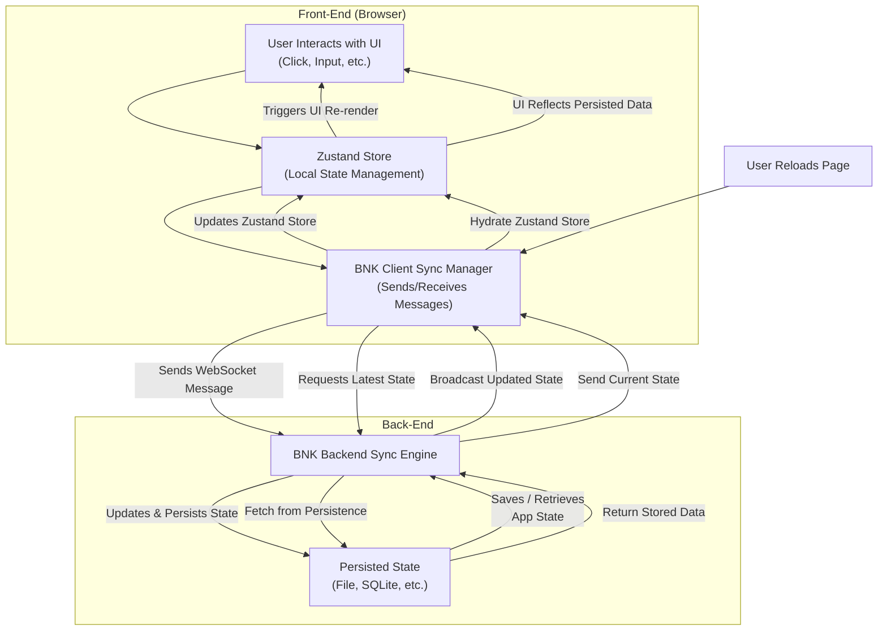

# Zustand Webhook Diagram

```mermaid
flowchart TB
    subgraph "Front-End (Browser)"
        A["User Interacts with UI\n(Click, Input, etc.)"]
        B["Zustand Store\n(Local State Management)"]
        C["BNK Client Sync Manager\n(Sends/Receives Messages)"]
    end

    subgraph "Back-End"
        D["BNK Backend Sync Engine"]
        E["Persisted State\n(File, SQLite, etc.)"]
    end

    %% Primary flow: updating state in real-time
    A --> B
    B --> C
    C -->|Sends WebSocket Message| D
    D -->|Updates & Persists State| E
    E -->|Saves / Retrieves\nApp State| D
    D -->|Broadcast Updated State| C
    C -->|Updates Zustand Store| B
    B -->|Triggers UI Re-render| A

    %% Handling page reload and fetching persisted state
    R["User Reloads Page"] --> C
    C -->|Requests Latest State| D
    D -->|Fetch from Persistence| E
    E -->|Return Stored Data| D
    D -->|Send Current State| C
    C -->|Hydrate Zustand Store| B
    B -->|UI Reflects Persisted Data| A
```
