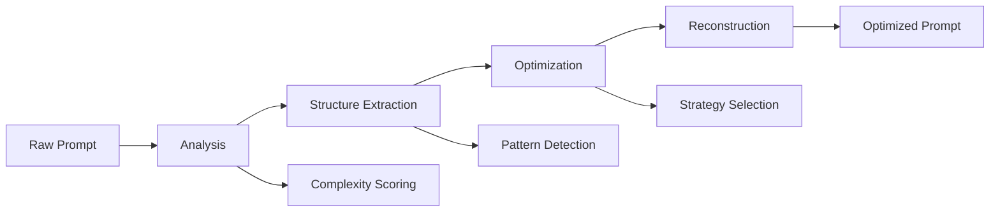
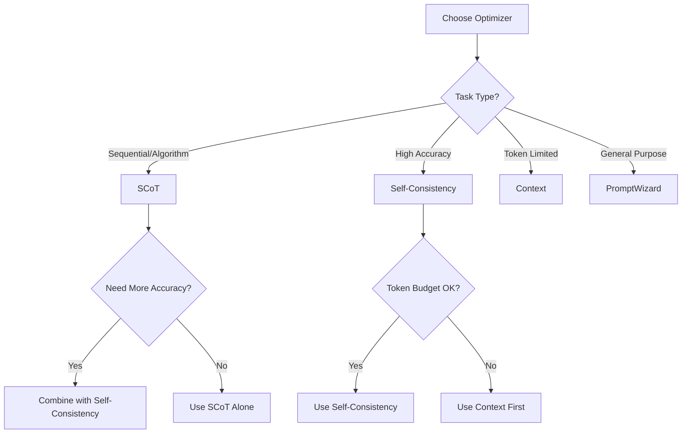

# Getting Started with @promptliano/prompt-engineer

## Introduction

Welcome to @promptliano/prompt-engineer, a sophisticated prompt optimization toolkit that delivers 40-70% improvement in prompt quality through cutting-edge engineering techniques. This guide will walk you through everything you need to get started.

## Table of Contents

- [Installation](#installation)
- [Core Concepts](#core-concepts)
- [Your First Optimization](#your-first-optimization)
- [Understanding Results](#understanding-results)
- [Choosing Optimizers](#choosing-optimizers)
- [Common Patterns](#common-patterns)
- [Next Steps](#next-steps)

## Installation

### Prerequisites

- Node.js 18+ or Bun 1.0+
- TypeScript 5.0+ (for TypeScript projects)

### Package Installation

```bash
# Using Bun (recommended for best performance)
bun add @promptliano/prompt-engineer

# Using npm
npm install @promptliano/prompt-engineer

# Using yarn
yarn add @promptliano/prompt-engineer

# Using pnpm
pnpm add @promptliano/prompt-engineer
```

### Basic Setup

```typescript
import { PromptEngineer } from '@promptliano/prompt-engineer'

// Create an instance with default optimizers
const engineer = new PromptEngineer()

// Or configure specific options
const engineer = new PromptEngineer({
  defaultOptimizer: 'scot',
  enableCaching: true,
  parallelOptimization: false
})
```

## Core Concepts

### What is Prompt Optimization?

Prompt optimization transforms raw, unstructured prompts into highly effective instructions that:

- **Improve accuracy** by 13-35% depending on task complexity
- **Reduce token usage** by 10-30% while maintaining quality
- **Increase consistency** by reducing output variance by up to 60%
- **Enable complex workflows** through automatic task decomposition

### The Optimization Pipeline



### Key Components

1. **Optimizers**: Transform prompts using different strategies
2. **Analyzers**: Extract structural information from prompts
3. **Strategies**: Handle complex multi-step workflows
4. **Plugins**: Extend functionality with providers and storage

## Your First Optimization

### Example 1: Simple Task Optimization

```typescript
import { PromptEngineer } from '@promptliano/prompt-engineer'

async function optimizeSimplePrompt() {
  const engineer = new PromptEngineer()
  
  const prompt = 'Write a function to validate email addresses'
  
  const result = await engineer.optimize(prompt, {
    optimizer: 'scot',
    context: {
      language: 'typescript',
      constraints: ['RFC 5322 compliant', 'Handle edge cases']
    }
  })
  
  console.log('Original:', prompt)
  console.log('Optimized:', result.optimizedPrompt)
  console.log('Improvement:', `${result.improvementScore}%`)
}
```

### Example 2: Complex Algorithm Optimization

```typescript
async function optimizeComplexAlgorithm() {
  const engineer = new PromptEngineer()
  
  const complexPrompt = `
    Implement a rate limiter that handles 10,000 requests per second
    with sliding window algorithm and Redis backend.
  `
  
  const result = await engineer.optimize(complexPrompt, {
    optimizer: 'scot',
    context: {
      language: 'typescript',
      examples: [
        { 
          input: 'user123 makes 5 requests in 1 second',
          output: 'all requests allowed'
        },
        {
          input: 'user123 makes 101 requests in 1 minute',
          output: 'request 101 blocked'
        }
      ],
      performance: 'sub-millisecond latency',
      constraints: [
        'Thread-safe implementation',
        'Graceful degradation on Redis failure'
      ]
    }
  })
  
  // The optimized prompt will include:
  // - Clear step-by-step implementation guide
  // - Edge case handling
  // - Performance considerations
  // - Error recovery strategies
  
  return result
}
```

## Understanding Results

### The OptimizedPrompt Object

```typescript
interface OptimizedPrompt {
  originalPrompt: string       // Your input prompt
  optimizedPrompt: string      // The enhanced version
  systemPrompt: string         // System-level instructions
  userPrompt: string           // User-facing prompt
  reasoningStructure: {        // Structural analysis
    sequences: Step[]          // Sequential steps
    branches: Condition[]      // Conditional logic
    loops: Loop[]             // Iteration patterns
    dataFlow: Pattern[]       // Data transformations
    complexity: Score         // Complexity metrics
  }
  optimizationStrategy: {      // Strategy used
    name: string
    techniques: string[]
    confidence: number
  }
  estimatedTokens: number      // Token count estimate
  improvementScore: number     // Percentage improvement
  metadata: {                  // Additional info
    duration: number
    optimizer: string
    timestamp: number
  }
}
```

### Interpreting Scores

#### Improvement Score (0-100%)
- **0-10%**: Minimal improvement, prompt was already well-structured
- **10-20%**: Good improvement, added clarity and structure
- **20-30%**: Significant improvement, major restructuring
- **30%+**: Excellent improvement, complete transformation

#### Complexity Scores (0-10)
- **Cognitive**: How difficult for humans to understand
- **Computational**: How difficult for LLMs to process
- **Structural**: How complex the logic structure is
- **Overall**: Weighted average of all scores

### Analyzing Structure

```typescript
const analysis = engineer.analyze(prompt)

// Sequences: Step-by-step procedures
console.log('Steps:', analysis.sequences.map(s => s.description))

// Branches: Conditional logic
console.log('Conditions:', analysis.branches.map(b => b.condition))

// Loops: Iteration patterns
console.log('Loops:', analysis.loops.map(l => l.type))

// Complexity
console.log('Difficulty:', analysis.complexity.overall)
```

## Choosing Optimizers

### Optimizer Comparison

| Optimizer | Best For | Improvement | Speed | Token Usage |
|-----------|----------|-------------|-------|-------------|
| **SCoT** | Algorithmic problems, step-by-step tasks | 13-16% | Fast | +10-20% |
| **Self-Consistency** | High accuracy needs, critical decisions | 20-31% | Slow | +50-100% |
| **Context** | Token-limited scenarios, compression | 8-15% | Very Fast | -20-30% |
| **PromptWizard** | Self-evolving optimization | 25-40% | Medium | +30-50% |

### Decision Tree



### Optimizer Configurations

#### SCoT (Structured Chain of Thought)

```typescript
const scotOptimizer = {
  optimizer: 'scot',
  context: {
    depth: 'detailed',        // 'minimal' | 'standard' | 'detailed'
    includeExamples: true,
    maxSequenceSteps: 10,
    maxBranches: 5,
    language: 'typescript'    // Language-specific optimizations
  }
}
```

#### Self-Consistency

```typescript
const consistencyOptimizer = {
  optimizer: 'self-consistency',
  context: {
    samples: 5,               // Number of reasoning paths
    temperatureRange: [0.3, 0.9],
    votingStrategy: 'weighted',
    minConfidence: 0.7
  }
}
```

#### Context Optimizer

```typescript
const contextOptimizer = {
  optimizer: 'context',
  context: {
    maxTokens: 4096,          // Token budget
    priorityStrategy: 'relevance',
    compressionLevel: 'moderate',
    preserveExamples: true
  }
}
```

## Common Patterns

### Pattern 1: Two-Pass Optimization

```typescript
async function twoPassOptimization(prompt: string) {
  const engineer = new PromptEngineer()
  
  // First pass: Structure with SCoT
  const structured = await engineer.optimize(prompt, {
    optimizer: 'scot',
    context: { depth: 'detailed' }
  })
  
  // Second pass: Improve consistency
  const final = await engineer.optimize(structured.optimizedPrompt, {
    optimizer: 'self-consistency',
    context: { samples: 3 }
  })
  
  return {
    totalImprovement: structured.improvementScore + final.improvementScore,
    finalPrompt: final.optimizedPrompt
  }
}
```

### Pattern 2: Context-Aware Optimization

```typescript
async function contextAwareOptimization(prompt: string, maxTokens: number) {
  const engineer = new PromptEngineer()
  
  // Check if we need compression
  const analysis = engineer.analyze(prompt)
  const estimatedTokens = analysis.complexity.overall * 100 // Rough estimate
  
  if (estimatedTokens > maxTokens) {
    // Compress first
    const compressed = await engineer.optimize(prompt, {
      optimizer: 'context',
      context: { maxTokens: maxTokens * 0.8 }
    })
    
    // Then optimize structure
    return engineer.optimize(compressed.optimizedPrompt, {
      optimizer: 'scot'
    })
  }
  
  // Direct optimization if within budget
  return engineer.optimize(prompt, { optimizer: 'scot' })
}
```

### Pattern 3: Domain-Specific Optimization

```typescript
async function domainSpecificOptimization(prompt: string, domain: string) {
  const engineer = new PromptEngineer()
  
  const domainContexts = {
    'code': {
      language: 'typescript',
      includeTests: true,
      includeErrorHandling: true
    },
    'analysis': {
      includeMethodology: true,
      requireEvidence: true,
      structuredOutput: true
    },
    'creative': {
      temperature: 0.8,
      allowVariation: true,
      multipleApproaches: true
    }
  }
  
  return engineer.optimize(prompt, {
    optimizer: 'scot',
    context: domainContexts[domain] || {}
  })
}
```

### Pattern 4: Batch Processing

```typescript
async function batchOptimization(prompts: string[]) {
  const engineer = new PromptEngineer()
  
  // Process in parallel with progress tracking
  const results = await Promise.all(
    prompts.map(async (prompt, index) => {
      console.log(`Processing ${index + 1}/${prompts.length}`)
      
      try {
        const result = await engineer.optimize(prompt)
        return { success: true, result }
      } catch (error) {
        return { success: false, error, prompt }
      }
    })
  )
  
  // Summary statistics
  const successful = results.filter(r => r.success)
  const avgImprovement = successful.reduce(
    (sum, r) => sum + r.result.improvementScore, 0
  ) / successful.length
  
  return {
    results,
    summary: {
      total: prompts.length,
      successful: successful.length,
      failed: prompts.length - successful.length,
      averageImprovement: avgImprovement
    }
  }
}
```

## Next Steps

### Learn More

1. **[Plugin Development Guide](./plugin-development.md)**: Create custom optimizers and providers
2. **[Security Best Practices](./security.md)**: Implement prompt security and hardening
3. **[Multi-Modal Processing](./multimodal.md)**: Work with images, audio, and documents
4. **[Benchmarking Guide](./benchmarking.md)**: Evaluate your prompts with industry standards

### Advanced Topics

- **Custom Optimizers**: Build domain-specific optimization strategies
- **Provider Integration**: Connect to any LLM provider
- **Production Deployment**: Scale prompt optimization in production
- **Performance Tuning**: Optimize for speed and token usage

### Get Help

- **GitHub Issues**: [Report bugs or request features](https://github.com/promptliano/promptliano/issues)
- **Discord Community**: [Join discussions](https://discord.gg/promptliano)
- **Documentation**: [Full API reference](../api/index.html)

## Quick Reference

### Common Optimizations

```typescript
// Basic optimization
const basic = await engineer.optimize(prompt)

// With specific optimizer
const scot = await engineer.optimize(prompt, { optimizer: 'scot' })

// With context
const withContext = await engineer.optimize(prompt, {
  optimizer: 'scot',
  context: {
    language: 'python',
    constraints: ['memory efficient', 'readable']
  }
})

// With caching
const cached = await engineer.optimize(prompt, {
  optimizer: 'scot',
  cache: true
})

// Analysis only
const analysis = engineer.analyze(prompt)
```

### Configuration Options

```typescript
// Initialize with configuration
const engineer = new PromptEngineer({
  optimizers: ['scot', 'context'],     // Load specific optimizers
  defaultOptimizer: 'scot',            // Default choice
  enableCaching: true,                 // Cache results
  parallelOptimization: true,          // Parallel processing
  plugins: [                           // Add plugins
    createMemoryStorage(),
    createHTTPProvider(apiKey)
  ]
})
```

### Error Handling

```typescript
try {
  const result = await engineer.optimize(prompt)
  // Handle success
} catch (error) {
  if (error.code === 'OPTIMIZER_NOT_FOUND') {
    // Handle missing optimizer
  } else if (error.code === 'CONTEXT_INVALID') {
    // Handle invalid context
  } else {
    // Handle general error
  }
}
```

## Summary

You're now ready to start optimizing prompts with @promptliano/prompt-engineer! Remember:

1. **Start simple**: Use basic optimization first
2. **Add context**: Provide relevant context for better results
3. **Choose wisely**: Select optimizers based on your needs
4. **Iterate**: Combine optimizers for best results
5. **Monitor**: Track improvement scores and token usage

Happy prompt engineering!